                                     

<br>

# Instrucciones generales

- **Entorno:** Visual Studio 2022 (Community). Proyectos Windows Forms y Consola en C#.
- **Alcance del Tema 3:** Sentencias condicionales (`if`, `if-else`, `if` anidado, `switch`), sentencias de repetición (con condición, con contador `for`, `foreach`) y sentencias de salto (`break` y `return`). Método de conversión `Try-Parse`.
- **Estilo de código (Microsoft):**
  - Variables y parámetros: camelCase (p. ej., precioNeto).
  - Constantes/propiedades: PascalCase (p. ej., Iva, TipoCambio).
  - Controles en Forms: txtNombre, lblResultado, btnCalcular, etc.
  - Sentencias `if -else` con llaves (incluso con una única sentencia dentro)
- **Buenas prácticas:**
  - Importes en decimal (sufijo m).
  - Parámetros fijos (IVA, retención) en `const`.
  - Salidas con **cadenas interpoladas** y **formato** (C2, P1, N0, …) cuando aplique.
  - Controlar excepciones y usar `finally` cuando sea necesario.

## Índice de ejercicios

**Bloque A – Sentencias condicionales (if, if-else, if anidado)** → Ej. 1–5  
**Bloque B – Sentencia switch** → Ej. 6–8  
**Bloque C – Aplicaciones numéricas. Formateo de texto en label** → Ej. 9-12  
**Bloque D – Método de conversión TryParse** → Ej. 13–15  
**Bloque E – Sentencias de repetición** → Ej. 16–30  
**Bloque F – Sentencias de salto** → Ej. 31- 33  
**Bloque G – Extra / ampliación** → Ej. 34-35  


<br>

# Bloque A – Sentencias condicionales

## Ejercicio 1: Comprobación de número

Realiza un programa que lea un número entero introducido por el usuario desde la consola. **Si el número es 2**, debe mostrar el mensaje: 

- "El número introducido es el 2". 
En caso contrario, debe mostrar: 
- "El número introducido NO es el 2".

## Ejercicio 2: Comparativa de 2 números enteros

Realiza un programa que lea **dos números enteros** introducidos por el usuario desde la consola y muestre un mensaje indicando si **son iguales o no**.

## Ejercicio 3: Obtener número mayor

Realiza un programa que pida **dos números enteros** al usuario por consola y muestre por pantalla cuál de los dos **es el mayor**.

En caso de que ambos números sean iguales, debe mostrar también el mayor (que será el mismo valor).

## Ejercicio 4: Comprobar número de serie

Supongamos que una empresa que fabrica repuestos ha detectado como defectuosos los productos con número de serie comprendidos entre (14681 y 15681), (70001 y 79999), (88888 y 111111). 

Realizar un programa que permita leer un número de serie y nos diga si es o no defectuoso. Utiliza `label`, `textbox` (para introducir número) y `button` para realizar el programa en **Windows Forms**.

## Ejercicio 5: Nota → Calificación

Realiza un programa que lea una **nota numérica con decimales** introducida por el usuario a través de la consola y muestre un mensaje indicando su calificación según el siguiente criterio:

1. 	**Muy deficiente:** nota inferior a 3
2. 	**Insuficiente:** nota entre 3 (inclusive) y 5 (exclusiva)
3. 	**Suficiente:** nota entre 5 (inclusive) y 6 (exclusiva)
4. 	**Bien:** nota entre 6 (inclusive) y 7 (exclusiva)
5. 	**Notable:** nota entre 7 (inclusive) y 9 (exclusiva)
6. 	**Sobresaliente:** nota igual o superior a 9
   
Por ejemplo, si el usuario introduce la nota 7,25, el programa debe mostrar: "Notable".

Si el usuario introduce una nota incorrecta el programa mostrará un mensaje de error.

<br>

# Bloque B – Sentencia switch

## Ejercicio 6: Selección de día semanal

Realizar un programa que lea el nombre de un día de la semana (por ejemplo: "lunes", "martes", etc.) e imprima un mensaje personalizado utilizando la estructura switch case. **(Consola)**

El programa debe mostrar un mensaje relacionado con el día introducido.
Por ejemplo:

- Si el usuario introduce "lunes", el programa debe mostrar: **"Inicio de semana, ¡ánimo!"**
  
- Si introduce "viernes", debe mostrar: **"¡Por fin es viernes!"**

- Si introduce "domingo", debe mostrar: **"Día de descanso."**

Si el texto introducido no corresponde a un día válido, el programa debe mostrar un mensaje de error indicando que la entrada no es reconocida.

## Ejercicio 7: Selección de tarea del hogar (Uso de sentencia de selección y repetición)

Realizar un programa de consola en **C#** que lea una instrucción escrita por el usuario relacionada con tareas del hogar. **(Consola)**

Las instrucciones válidas son:

- "lavar los platos"
- "barrer el piso"
- "sacar la basura"
- "regar las plantas"
- "hacer la cama"
  
El programa debe:

- Usar `switch` para mostrar un mensaje según la tarea. Por ejemplo: “Lavando los platos…”
- Repetir el proceso hasta que el usuario escriba "salir".
- Mostrar un mensaje de error si la instrucción no es válida.

## Ejercicio 8: Selección de categoría de producto (Agrupación de casos)

Imagina que estás desarrollando una aplicación para una tienda online. El usuario debe seleccionar una categoría de producto (del 1 al 6) siendo:

1. Teléfonos móviles
2. Ordenadores
3. Televisiones
4. Vestidos
5. Faldas
6. Pantalones

El programa mostrará inicialmente un mensaje con las categorías anteriores.

La aplicación una vez leída la categoría elegida mostrará para los tres primeros casos los siguientes mensajes:  
**Has seleccionado una categoría de productos electrónicos.
Promoción: Financiación disponible hasta en 12 meses sin intereses.**

Y en los tres siguientes:  
**Has seleccionado una categoría de productos de moda.
Promoción: 3x2 en artículos seleccionados.**

Y en caso de introducir otra categoría diferente el programa indicará el siguiente mensaje de error:  
**Categoría no reconocida. Por favor, selecciona una opción válida del menú.**

<br>

# Bloque C – Aplicaciones numéricas. Formateo de texto en label

## Ejercicio 9: Agregar texto en label

Realizar un programa en el que se pueda ir introduciendo texto. Este texto se irá añadiendo cada vez que pulsemos el botón se añadirá el texto al Label. 

`Ayuda: **"\n"** para introducir fin de línea.`

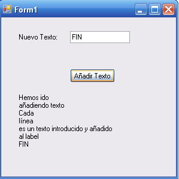

## Ejercicio 10: Calcular billetes y monedas (dinero en pesetas)

Realizar un programa que pida una cantidad de dinero (en pesetas), y muestre en una etiqueta cuantos billetes de 10.000, de 5.000, de 2.000, de 1000 y monedas de 100 y 25 le corresponden. 

Por ejemplo: 27.375 le corresponde 2 de 10.000, 1 de 5.000, 1 de 2.000, 3 de 100 y 3 de 25. 

Hacerlo de forma que si corresponde 0 billetes no aparezca. 

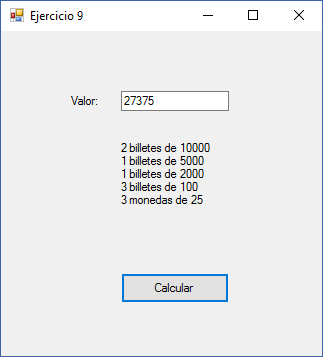


## Ejercicio 11: Calcular billetes y monedas (dinero en euros con decimales)

Realizar un programa en el que el usuario introduzca una cantidad en euros (con decimales) y obtengamos los billetes y monedas de euro correspondientes, así como las monedas de céntimos correspondientes. 

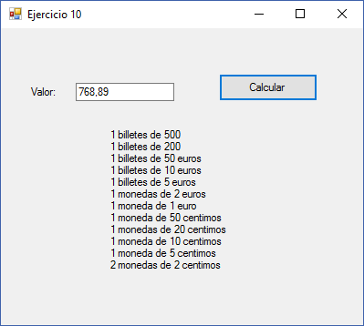

## Ejercicio 12: Un Segundo Más: Validación y Actualización de Hora

Realizar un programa en el que introduzcamos una hora con minutos y segundos. 

Tras validar los datos (que sea una hora correcta) nos escribirá **la hora de un segundo después**. 

Validar la hora significa que la hora esté entre 0 y 23, los minutos entre 0 y 59 y los segundos entre 0 y 59, en otro caso nos dará un mensaje de error.

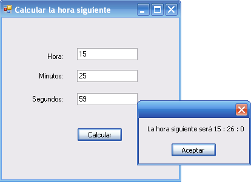


# Bloque D – Método de conversión TryParse

<hr>
El patrón `TryParse` es muy común y se utiliza para convertir **cadenas de texto** a diferentes tipos de datos de forma segura, sin lanzar excepciones si la conversión falla.

¿Por qué usar TryParse?

- **Evita errores:** No lanza excepciones si la conversión falla.
- **Devuelve true/false:** Puedes comprobar si la conversión fue exitosa antes de usar el valor.
- Muy útil para validar entradas del usuario.

La sintaxis general de los métodos `TryParse` en C# es la siguiente:

`TipoDato.TryParse(string texto, out TipoDato variable)`

- **TipoDato:** El tipo de dato al que quieres convertir (`int`, `double`, `bool`, `Enum`, etc.)
- **texto:** La cadena que queremos convertir.
- **variable:** La variable donde se guarda el resultado si la conversión es exitosa.

<hr>

<br>

## Ejercicio 13: (Resuelto) TryParse y diagnóstico (sin if)

Realizar un programa de consola que pida un número entero y muestre si la conversión ha sido correcta y el valor leído. (**Aplicación de Consola**).

Nota: En el caso de conversión a entero: `int.TryParse(cadena, out int valor);` devuelve `true` si la conversión es válida y en valor queda el número (o 0 si falla).

Código (copia y pega en Program.cs):

```csharp
static void Main(string[] args)
{
    Console.Write("Introduce un número entero: ");
    string texto = Console.ReadLine();

    bool exito = int.TryParse(texto, out int num);

    Console.WriteLine($"Éxito: {exito}");
    Console.WriteLine($"Valor leído: {num}");

    Console.WriteLine("Pulse una tecla para salir...");
    Console.ReadKey();
}
```

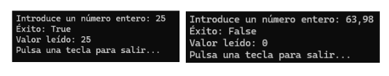

## Ejercicio 14: Uso de foreach – enum (Consola)

Crea un programa que defina un `enum` llamado `TipoVehiculo` con los valores: `Coche`, `Moto`, `Bicicleta`, `Autobús` y `Camión`. 

El programa debe mostrar por pantalla la lista de todos los tipos de coche, uno por línea, utilizando un bucle foreach para recorrer el enumerado.

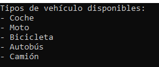

## Ejercicio 15: TryParse y enum (con if)

A partir del código del programa anterior, añadimos lo siguiente:

- El programa pide al usuario que introduzca su tipo de vehículo.
  
- Convertimos la entrada del usuario al enumerado.
  
- Si el valor introducido está definido en el enumerado se mostrará mensaje indicando que el vehículo seleccionado es válido. Si no, se indicará que no es válido.

Uso de método `isDefined` el cual devuelve un booleano indicando si está definido o no. En caso de no ser válido se indicará mensaje de error. Sintaxis:

`Enum.IsDefined(typeof(TipoVehiculo), vehiculoSeleccionado)`

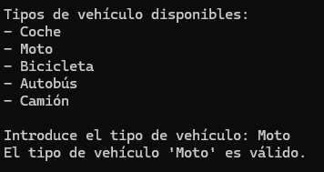 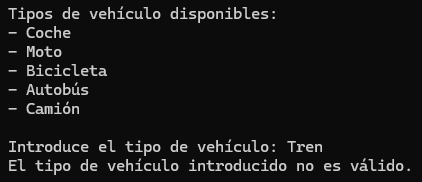

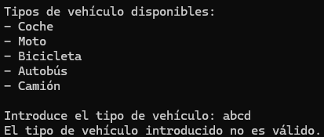

<br>

# Bloque E – Sentencias de repetición

## Ejercicio 16: Suma del 1 al 10 con for, while y do-while (comparativa de bucles)

Realizar un programa que **sume** los 10 primeros números (del 1 al 10). Hacer con for, con while y do-while. (**Windows Forms** con tres botones)

<hr>

### Función InputBox

En algunos de los ejercicios que vienen a continuación vamos a utilizar `InputBox`, una función del lenguaje Visual Basic, que nos permite introducir un texto con un cuadro de diálogo. 

Para usarla en C#, necesitas importar el espacio de nombres:

```csharp
using Microsoft.VisualBasic;
```

Y crearemos el proyecto de tipo: **Aplicación de Windows Forms**

Sintaxis:
```csharp
string texto;
 
texto = Interaction.InputBox("Texto del cuadro de diálogo", "Título del InputBox", "Respuesta por defecto");
```

Siendo los dos últimos parámetros opcionales.

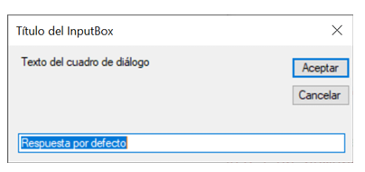

 
Si el valor leído fuera un número tendríamos que hacer la conversión correspondiente:

```csharp
int numero = int.Parse(Interaction.InputBox("Introduce un número"));
```

Nota: Puedes usar `int.TryParse` para evitar errores si el usuario introduce texto no numérico.

<hr>

<br>

## Ejercicio 17: Cálculo de número mayor y menor (Bucle – Inputbox)

Escribir un programa que acepte números enteros positivos. **Los irá pidiendo con `InputBox`**. 

El programa irá aceptando números hasta que se introduzca un número negativo. 
Sacará por pantalla cuál es el número mayor y el menor de todos los números introducidos (sin contar el negativo). (**Windows Forms** con un botón)

## Ejercicio 18: Suma de números (Bucle – Inputbox)

Realizar un programa **similar al anterior**, en el que se vayan introduciendo números mediante `Inputbox` y **se sumen** siempre y cuando estos números estén entre 0 y 9, en otro caso terminará la introducción de números mostrando cuál es la suma.

## Ejercicio 19: Mostrar múltiplos

Realizar un programa que nos visualice los **múltiplos de 3** que hay entre 1 y 100 **(Consola)**.

## Ejercicio 20: Suma de pares

Realizar un programa que calcule la **suma** de los **números pares del 1 al 50** **(Consola)**.

## Ejercicio 21: Calcular factorial

Realiza un programa que calcule el factorial de un número introducido por el usuario **(Windows Forms)**.

Por ejemplo, el factorial de 5 es 5! = 5 * 4 * 3 * 2 * 1. 

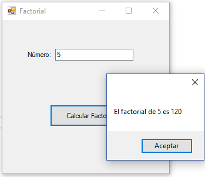


## Ejercicio 22: Calcular potencia mediante productos

Realizar un programa que eleve un numero a una potencia, siendo la base número entero y el exponente también. 

Realizar la potencia mediante productos sucesivos. **5<sup>4</sup> = 5 * 5 * 5 * 5 (Consola)**

## Ejercicio 23: Mostrar serie según número

Realizar un programa que lea un numero n comprendido entre 1 y 15 y visualice n veces la serie de números 1,2,3...... hasta el 10.

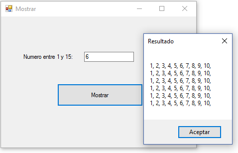


## Ejercicio 24: Calcular pesos (alumnos por rango - porcentajes – peso medio)

Realizar un programa en el que vayamos introduciendo el peso de los distintos alumnos de una clase. Los pesos se irán introduciendo y leyendo hasta que se introduzca un **peso negativo**. 

Queremos obtener **cuántos alumnos** hay en cada uno de los rangos de peso siguientes: (<=50), (>50 y <=65), (>65 y <=80), (>80) así como **el tanto por ciento** que representan frente al total de alumnos y el **peso medio** de toda la clase. **(Consola)**


## Ejercicio 25: Tabla de multiplicar

Realizar un programa que escriba por pantalla la tabla de multiplicar de un número que tiene que ser >0 y <=100. **(Windows Forms)**. 

**Ejemplo:** Si introducimos número 9:

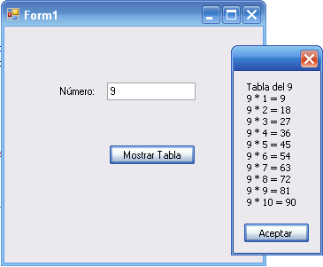
 

## Ejercicio 26: Tablas de multiplicar del 1 al 10

Realizar un programa por **Consola** que nos escriba las tablas de multiplicar del uno al 10.

## Ejercicio 27: Suma y visualización de serie aritmética

Realizar un programa que **escriba y sume** la serie **3, 6, 9, ...99,** teniendo en cuenta que solo puede escribir 7 números por línea. (**Windows Forms**)

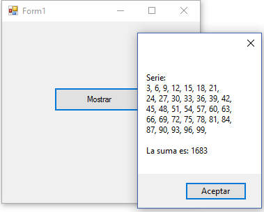

 
## Ejercicio 28: Verificar número primo

Realizar un programa que nos diga si un número positivo introducido es o no primo. Un número primo es aquel que **solo es divisible entre 1 y sí mismo. (Consola)**

**Ejemplo:** 7 es primo, ya que sólo es divisible entre 1 y 7

**Ejemplo:** 6 no es primo, ya que es divisible por 1, 2, 3 y 6.

## Ejercicio 29: Cálculo de producto mediante sumas

Realizar un programa que calcule el producto de dos números usando sumas. Hay que tener en cuenta que los números pueden ser positivos o negativos **(Consola)**

**Ejemplo:** 5 * 4 = 4 + 4 + 4 + 4 + 4. (el programa calcula el producto de 5 y 4 mediante sumas)
**Resultado final que ha de mostrar el programa:** 20

## Ejercicio 30: Cálculo de serie de sumas y restas

Realizar un programa que calcule el valor de la suma de la siguiente serie para un numero n leído por teclado y mayor que 0. **(Consola)**

**Serie: 1 - 1/2 + 1/3 - 1/4........(+ -) 1/n**

<br>

# Bloque F – Sentencias de salto

## Ejercicio 31: Verificar acceso con usuario y contraseña (5 intentos)

Realizar un programa en Windows Forms con un único botón que permita al usuario acceder al sistema mediante la introducción de sus credenciales.

Requisitos:
- La interfaz tendrá **un solo botón** con el texto: **"Acceder al sistema"**.
  
- Al hacer clic en el botón, se debe solicitar al usuario **su nombre de usuario** y **contraseña** mediante `InputBox`.
  
- Las credenciales válidas son:
  - **Usuario:** root
  - **Contraseña:** 1234
  
- El usuario dispone de **cinco intentos** para introducir los datos correctos.
  
- En cada intento fallido, se debe mostrar un mensaje indicando el número de intentos restantes.
  
- Si el usuario introduce las credenciales correctas, se mostrará el mensaje:
**"Bienvenido al sistema"**.

- Si se agotan los cinco intentos sin éxito, se mostrará el mensaje:
**"Se ha superado el número de intentos permitido"**.

**Nota: Este ejercicio se desarrollará en dos versiones:**
	
- Ejercicio31a:
  
  Utiliza una **variable booleana** para controlar la salida del bucle cuando el usuario introduce las credenciales correctas.

- Ejercicio31b:
  Utiliza la sentencia `break` para salir del bucle en caso de éxito.


## Ejercicio 32: Control de aforo en una sala de cine

Escribir un programa en **Windows Forms** que permita registrar la entrada de personas a una sala de cine con un aforo máximo de 50 personas. La interfaz tendrá un único botón con el texto “Comenzar registro” en el cual se irán registrando las entradas del siguiente modo:

- Cada persona que desea acceder puede solicitar **más de una entrada**. El programa debe solicitar al usuario, mediante un `InputBox`, el número de entradas que desea adquirir.
  
- El proceso de registro debe continuar hasta que se **alcance el aforo máximo** o el **usuario introduzca el valor -1**, que indica el fin voluntario del registro.
  
- Si el número de entradas solicitado supera el aforo disponible, el programa debe mostrar el mensaje **"No es posible el acceso, se supera el aforo. Quedan x entradas."** 
  
- Si el aforo se completa totalmente se deberá mostrar el mensaje **"Aforo completado"** y finalizará el registro.
  
- Al finalizar el proceso (ya sea por completar el aforo o por decisión del usuario) el programa debe mostrar el **número total de asistentes registrados**.

**Nota: Este ejercicio se desarrollará en dos versiones:**

- Ejercicio32a:
  Utiliza la sentencia `break` para finalizar el bucle cuando se cumpla alguna condición de salida.

- Ejercicio32b:
  No utiliza la sentencia `break`; el control del bucle se realiza mediante condiciones lógicas.


## Ejercicio 33: Control de calidad en una fábrica (Uso de Sentencia return)

Se trata de un programa de control de calidad en una fábrica donde se revisan 5 productos. 

El programa para cada producto preguntará al usuario si está defectuoso, de modo que si lo está el programa mostrará el mensaje **"Producto defectuoso detectado. Deteniendo el proceso."** y finalizará. 

En caso contrario mostrará el mensaje **"Producto aprobado"** y continuará la revisión.
**(Consola)**

**Ejemplo:** Tercer producto defectuoso
 
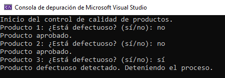

**Ejemplo:** Todos los productos aprobados

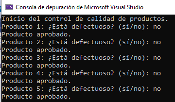

<br>

# Bloque G – Extra / Ampliación

## Ejercicio 34: Registro de ventas en una tienda (TryParse, Bucles) (Consola)

Realiza un programa que registre los precios de los productos vendidos en una tienda durante el día. 
El programa pedirá al usuario que introduzca el precio de cada producto vendido y finalizará cuando el usuario escriba **"fin"** y mostrará:

- El número total de productos vendidos.

- El total de ingresos.

- El precio medio por producto.

Ejemplo:

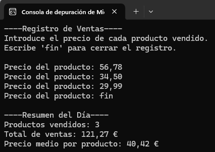


## Ejercicio 35: Configurar velocidad en un videojuego 
## (Sentencias condicionales y de repetición, TryParse, Enum) (Consola)

Realiza un programa que permita al usuario seleccionar el nivel de dificultad de un videojuego antes de comenzar la partida. 

Los niveles de dificultad son: **Facil, Normal, Dificil y Experto**. 
Al iniciar el programa se mostrarán al usuario los niveles disponibles y le pedirá que introduzca el nivel deseado. 

- Si el nivel introducido **no es válido**, el programa mostrará el mensaje "**Nivel no válido. Inténtelo de nuevo"** y se volverá a pedir al usuario que seleccione un nivel correcto.

- Si el nivel introducido **es válido**, el programa mostrará el mensaje **"Nivel seleccionado con éxito"** y preguntará si desea iniciar la partida.
  - Si el usuario responde **"sí"**, el programa finaliza con el mensaje **"Inicio de partida"**.
  - Si responde **"no"**, el programa finaliza con el mensaje **"Partida cancelada"**.
  - Si el usuario responde con una entrada no válida, el programa finalizará con el mensaje **"Respuesta no válida. El programa finalizará"**.


**Ejemplos de ejecución:
Ejemplo 1:** 
 
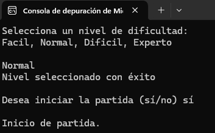


Ejemplo2: 
 
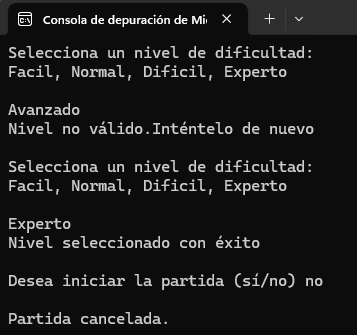

Ejemplo3: 
 
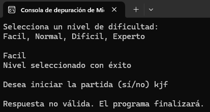


